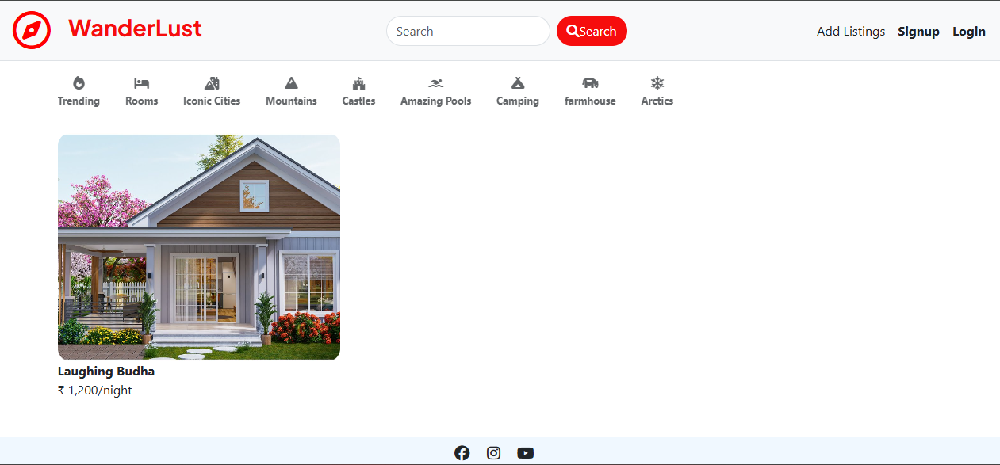

WanderLust 🌍

A full-stack vacation rental and property listing web application inspired by Airbnb. Users can explore travel stays, create property listings, upload images, leave reviews, and discover locations through an interactive and responsive interface.

🌐 Live Demo: WanderLust Live Website: https://wanderlust-ebch.onrender.com

📂 GitHub Repository: GitHub Repository

✨ Features
🔐 User Authentication & Authorization
🏠 Create, Edit & Delete Property Listings
🖼️ Image Upload using Cloudinary
⭐ Review & Rating System
📱 Fully Responsive UI
🛡️ Client-side & Server-side Validation
🍪 Session & Cookie Based Authentication
⚡ RESTful API Architecture

🛠️ Tech Stack

Frontend

HTML5
CSS3
JavaScript
Bootstrap
EJS Templates

Backend

Node.js
Express.js
Database
MongoDB Atlas
Mongoose
Authentication
Passport.js
Express Session

Cloud & APIs

Cloudinary
Render Deployment

📸 Screenshots
Home Page

Browse all listings with responsive cards and search functionality.
Listing Details
View detailed property information, pricing and reviews.
Authentication
Secure signup and login system.

📂 Folder Structure
WanderLust/
│
├── controllers/
├── models/
├── routes/
├── views/
├── public/
├── utils/
├── app.js
├── cloudConfig.js
├── middlewares.js
├── schemaValidation.js
└── package.json
⚙️ Installation & Setup
1️⃣ Clone the Repository
git clone <your-repository-url>
cd WanderLust
2️⃣ Install Dependencies
npm install
3️⃣ Create Environment Variables

Create a .env file in the root directory.

ATLASDB_URL=your_mongodb_url

CLOUD_NAME=your_cloudinary_cloud_name
CLOUD_API_KEY=your_cloudinary_api_key
CLOUD_API_SECRET=your_cloudinary_secret

SECRET=your_session_secret
4️⃣ Start the Server
node app.js

or

nodemon app.js

🚀 Deployment

The project is deployed on:

Render
MongoDB Atlas
Cloudinary
📚 Learning Outcomes

This project helped in understanding:

MVC Architecture
REST APIs
Authentication & Authorization
CRUD Operations
Responsive Web Design
Cloud Deployment
Database Modeling
Middleware & Error Handling

🔮 Future Improvements

💳 Payment Integration
❤️ Wishlist Feature
📅 Booking Availability Calendar
🧠 AI-based Recommendations
💬 Real-time Chat Support

👨‍💻 Author
Shayan Roy

B.Tech CSE Student
Full Stack Web Development Enthusiast
📄 License

This project is developed for learning and educational purposes.
